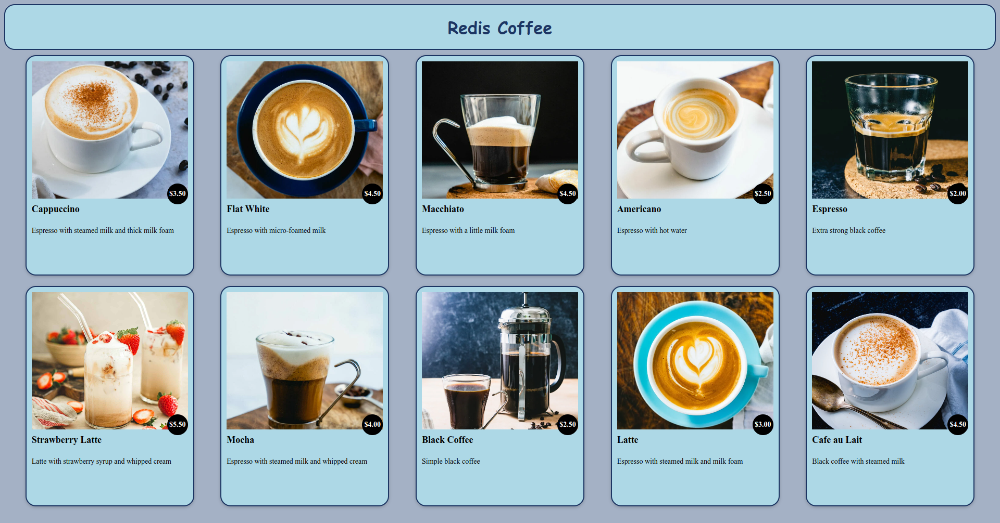

# Coffee-Website-with-Redis
Using:
- Redis as database
    - can view it in RedisInsight
- ViteJS as frontend
    - to install: `npm install`
    - to run: `npm run dev`
- Python Flask as backend
    - to install: `pip install flask flask_cors redis json`
    - to run: `./main.py`

Scripts
- To add a new coffe you can run addnewCoffeeToDB.py as `./addnewCoffeeToDB` 
    - change the name, the description, the url of the image and the price of the new coffee in the `add_coffee` function

Presentation: https://docs.google.com/presentation/d/1FgywTRKKNhIgSHViHGUz8HapMhB47__cDQsvkYCg_mw/edit?usp=sharing

